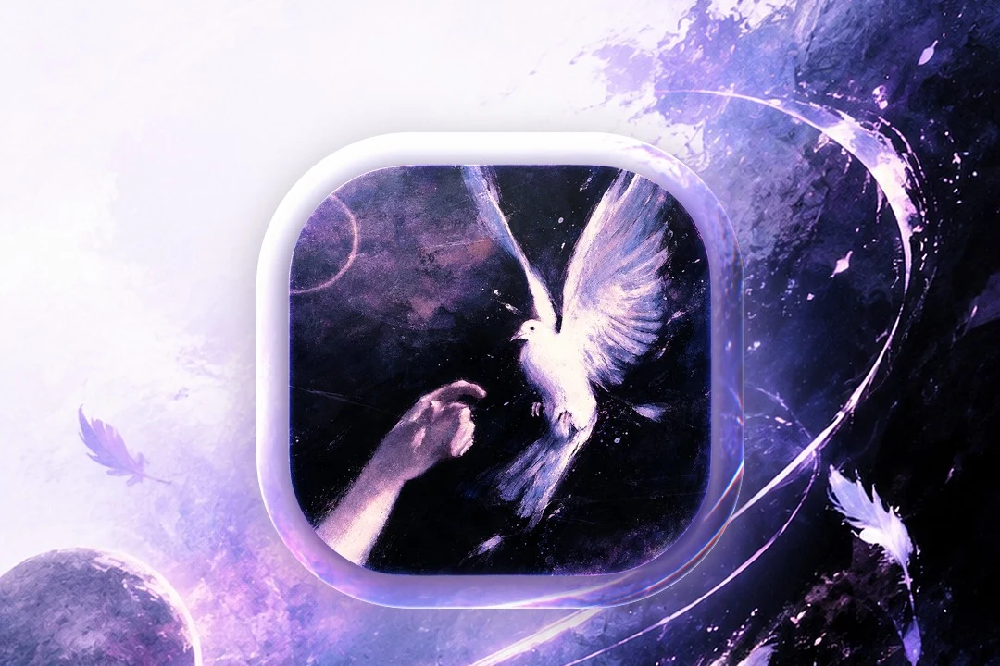
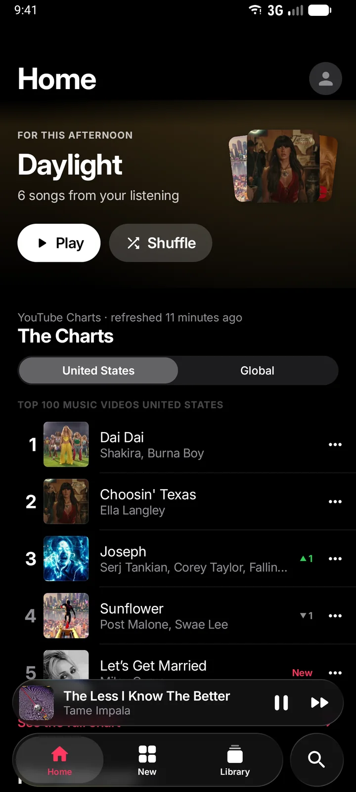
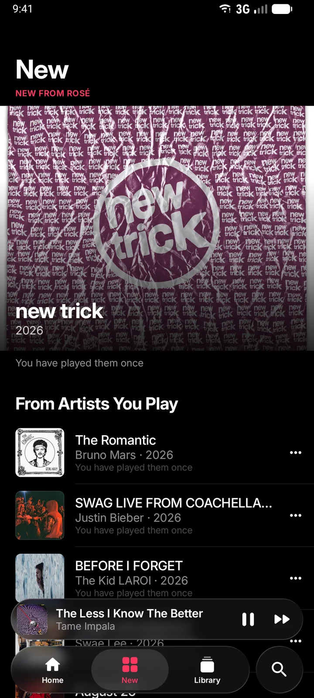
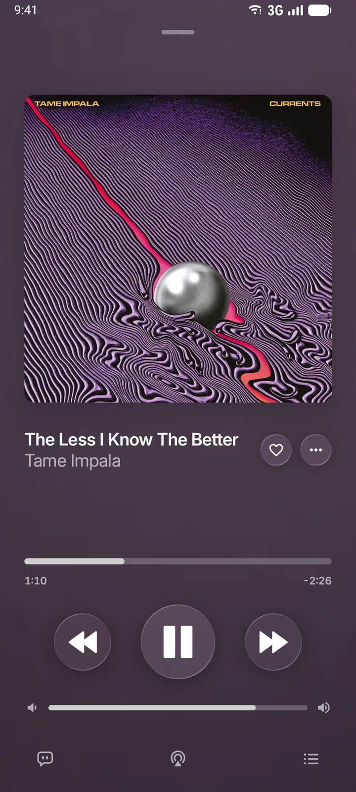
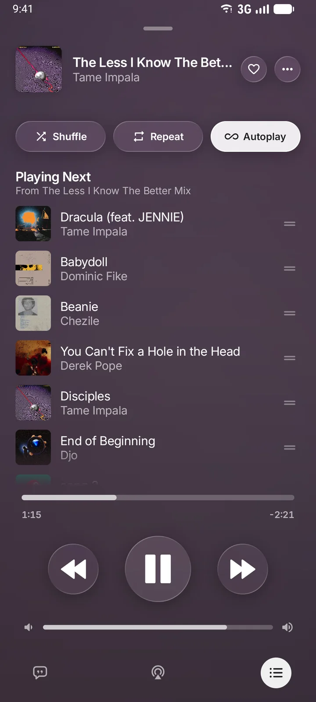
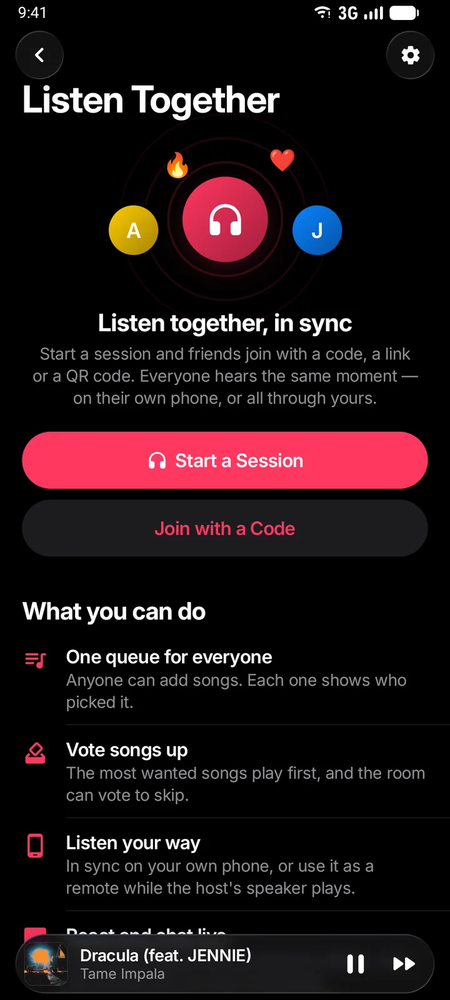

<div align="center">



<h1>Shiny</h1>

<p><b>A free music player for Android, designed like Apple Music.</b><br/>
Millions of songs from YouTube Music, lyrics that fill word by word, offline downloads and Listen Together.<br/>
No ads, and no account needed.</p>

<p>


</p>

<p>
<a href="https://github.com/lastdaytheOG/Shiny/releases/latest"><b>Download</b></a> ·
<a href="https://shinymusic.in"><b>Website</b></a> ·
<a href="#build-from-source"><b>Build</b></a> ·
<a href="PRIVACY_POLICY.md"><b>Privacy</b></a>
</p>

</div>

<table align="center">
  <tr>
    <td align="center"><br/><sub>Home</sub></td>
    <td align="center"><br/><sub>New</sub></td>
    <td align="center"><br/><sub>Now Playing</sub></td>
    <td align="center"><br/><sub>Up Next</sub></td>
    <td align="center"><br/><sub>Listen Together</sub></td>
  </tr>
</table>

---

## Features

### Listen
- **The whole YouTube Music catalogue, without ads.** Plays in the background and with the screen off.
- **Now Playing that belongs to the artwork.** The cover fills the screen over a slowly moving backdrop, with Lyrics and Up Next one swipe away.
- **Lyrics that fill word by word**, in time with the music.
- **Animated covers**, on albums that have one.
- **Crossfade**, gapless albums, volume levelling and skip silence.
- **Equaliser and sound effects:** presets, plus 8D audio, slowed, nightcore and reverb.
- **Smart Shuffle** on every playlist. The songs you play most come up a little earlier, without taking over the queue.
- **Ambient Mode** for a phone propped up on a desk.
- **Android Auto**.

### Discover
- **A Home that learns what you like:** mixes for the time of day, *Pick up where you left off*, and the charts for your country and the world.
- **New:** fresh releases from the artists you actually play.
- **Your Spotify mixes on Home**, once Spotify is connected.
- **Recognise the song playing around you**, from Search, a widget or a Quick Settings tile.
- **Listening stats.**

### Your library
- **Offline downloads** of songs, albums and playlists, saved to a folder you choose.
- **Music on your phone:** plays the audio files you already have.
- **Export as MP3.**
- **Import from Spotify:** your playlists and Liked Songs, or any public playlist by link.
- **Backup and restore.**
- **Open YouTube and YouTube Music links** straight in Shiny.

### Together
- **Listen Together.** Start a session, and friends join with a code, a link or a QR code; everyone hears the same moment.
  - One queue for everyone, showing who picked each song.
  - Vote songs up, and vote to skip.
  - Reactions and chat.
  - The host lets people in; up to 32 per session.
- **Shiny Social:** friends, a public profile page, and what your friends are listening to.
- **Discord:** your status shows what you're playing, with a button that opens the song in Shiny.
- **ListenBrainz** scrobbling.

### Look and feel
- **Liquid Glass design** modelled on Apple Music: real refracting glass, large bold type and calm motion.
- **Light, dark and AMOLED black.** Pick an accent colour, or take it from the artwork.
- **Make Now Playing yours:** artwork style, atmosphere, glow, glass finish, motion, page transitions and interface size.
- **Four home-screen widgets.**
- **50+ interface languages.** Some translations are partial.

---

## Download

Get the latest APK from **[Releases](https://github.com/lastdaytheOG/Shiny/releases/latest)** or **[shinymusic.in](https://shinymusic.in)**.

- **Requirements:** Android 8.0 or newer.
- **Which APK:** the `universal` APK works on every phone.
- **Updates:** Shiny checks GitHub Releases for new versions. You can turn this off in *Settings → About*.

<details>
<summary><b>Verify the APK</b></summary>
<br/>

Official releases are signed with the Shiny key. Check the certificate before installing:

```bash
apksigner verify --print-certs Shiny-*.apk
```

The SHA-256 digest must be:

```
F3:70:1C:9C:1C:87:54:F4:79:A9:D2:20:D6:E6:56:B1:12:1C:CA:43:B6:1C:7B:BE:FD:15:D8:32:A8:2B:19:46
```

</details>

---

## Privacy

- **No account needed.** Signing in to YouTube Music or connecting Spotify is optional.
- **Your library stays on your phone:** playlists, history, downloads and settings.
- **The Play build (`gms`)** sends crash reports and anonymous playback-health events to Firebase. These say *how* playback failed, never *what* you were playing.
- **The `foss` build** contains no Firebase at all.
- **Listen Together and Shiny Social** run on Shiny's own servers.

Full details: [PRIVACY_POLICY.md](PRIVACY_POLICY.md).

---

## Build from source

**Requirements:** JDK 21 and the Android SDK (compile SDK 36).

```bash
git clone https://github.com/lastdaytheOG/Shiny.git
cd Shiny
echo "sdk.dir=/path/to/Android/sdk" > local.properties

./gradlew assembleUniversalFossDebug   # no Google services
./gradlew assembleUniversalGmsDebug    # with Google sign-in and Firebase
```

- **Variants:** `foss` or `gms`, crossed with an ABI (`universal`, `arm64`, `armeabi`, `x86_64`, …).
- **`gms` builds** need a `google-services.json`.
- **Release builds** need your own signing key.
- The full setup, including Firebase and signing, is in **[SETUP.md](SETUP.md)**.

---

## Contributing

Bug reports and pull requests are welcome. Please read [CONTRIBUTING.md](CONTRIBUTING.md) and the [Code of Conduct](CODE_OF_CONDUCT.md) first. Report security issues privately, as described in [SECURITY.md](SECURITY.md).

---

## Acknowledgements

Shiny is a GPL-3.0 open-source project. It builds upon open-source work from [InnerTune](https://github.com/z-huang/InnerTune), [Metrolist](https://github.com/MetrolistGroup/Metrolist), [vivi-music](https://github.com/vivizzz007/vivi-music) and the other projects below, together with substantial modifications and original contributions by the Shiny Project: the Liquid interface, the player, lyrics engine, Home feed, Listen Together, sound effects and more. [NOTICE](NOTICE) holds the copyright notice and the upstream credits. Copyright notices that upstream authors placed in individual files are kept in those files.

### Special thanks

| Project | Contribution |
| :-- | :-- |
| **[InnerTune](https://github.com/z-huang/InnerTune)** | Foundational upstream code: the database, the InnerTube client, menus and much of the player |
| **[Metrolist](https://github.com/MetrolistGroup/Metrolist)** | Major upstream code and components: player, widgets, recognition, lyrics providers and stream resolution, including Francesco Grazioso's stream-client work |
| **[vivi-music](https://github.com/vivizzz007/vivi-music)** | Upstream modifications and components: the canvas and artist-video modules, YouLyPlus lyrics and the audio-device sheet |
| **[ArchiveTune](https://github.com/koiverse/ArchiveTune)** | The Spotify client and Spotify import code, and code in Discord presence and sign-in, the local-file scanner, the ListenBrainz client and Unison lyrics; artist videos use ArchiveTune's artwork service |
| **[Convx](https://github.com/cosmictaserdev-creator/Convx)** | The glass effect code (`GlassEffect.kt`) and the liquid-glass settings; Convx also did the vendoring of Kyant0/backdrop and compose-floating-tab-bar |
| **[MusicRecognizer](https://github.com/aleksey-saenko/MusicRecognizer)** | The basis of the music recognition |
| **[vibra](https://github.com/BayernMuller/vibra)** | The audio fingerprinting algorithm |
| **[NewPipe Extractor](https://github.com/TeamNewPipe/NewPipeExtractor)** and **[PipePipeExtractor](https://github.com/maxrave-dev/PipePipeExtractor)** | Stream extraction libraries |
| **[Kyant0/backdrop](https://github.com/Kyant0/AndroidLiquidGlass)** | The Liquid Glass material, vendored and modified (Apache-2.0) |
| **[compose-floating-tab-bar](https://github.com/elyesmansour/compose-floating-tab-bar)** | The floating tab bar, vendored and modified (Apache-2.0) |
| **[yt-dlp/ejs](https://github.com/yt-dlp/ejs)**, **[meriyah](https://github.com/meriyah/meriyah)** and **[astring](https://github.com/davidbonnet/astring)** | The JavaScript solver for stream signatures |
| **[FFmpegKit](https://github.com/arthenica/ffmpeg-kit)** | Audio conversion for MP3 export (LGPL-3.0) |
| **[Better Lyrics](https://better-lyrics.boidu.dev/)**, **[SimpMusic](https://github.com/maxrave-dev/SimpMusic)** and **[LRCLIB](https://lrclib.net)** | Lyrics services |

Built with Kotlin, Jetpack Compose, Media3 (ExoPlayer), Room, Hilt, Ktor, OkHttp and Coil. Every library in the app, with its licence, is listed in [`licenses/`](licenses).

---

## Legal

- **Free and non-commercial.** Shiny has no ads, subscriptions or paid features, and is made for personal and educational use.
- **An alternative client.** Shiny shows publicly available YouTube Music content in its own interface, much as a web browser with an ad blocker would.
- **Support the artists.** If you can, subscribe to [YouTube Premium](https://www.youtube.com/premium); it's the most direct way to support the musicians you listen to.
- **No media is hosted.** Shiny stores no audio, video or other copyrighted material on its servers; all content streams from YouTube's servers and belongs to its owners.
- **Use it lawfully.** The software is provided "as is", without warranty. You are responsible for following your local laws and the terms of the services you use.
- **Not affiliated** with or endorsed by Google, YouTube, Spotify, Discord or Shazam. All trademarks belong to their owners.

Questions about the code: [hello@shinymusic.in](mailto:hello@shinymusic.in)

---

## License and source code

Shiny is free software: you can redistribute it and modify it under the terms of the **[GNU General Public License v3.0](LICENSE)**. It comes with **no warranty**.

- **Source code.** Each release is built from a tagged commit of this repository; the source of a release is this repository at that tag. In the app, *Settings → About → Source code* opens this repository.
- **Notices.** [NOTICE](NOTICE) holds the copyright notice and the upstream projects.
- **Third-party licences.** Bundled components keep their own licences, including Apache-2.0, MIT, ISC, LGPL, OFL and the Unlicense. They are listed in [`licenses/`](licenses), and the same files travel inside every APK.
- **Compliance.** [LICENSE_COMPLIANCE.md](LICENSE_COMPLIANCE.md) describes how the licences are met and how a release's source is matched to its APK.

<div align="center">
<sub>Licensed under <a href="LICENSE">GPL-3.0</a></sub>
</div>
